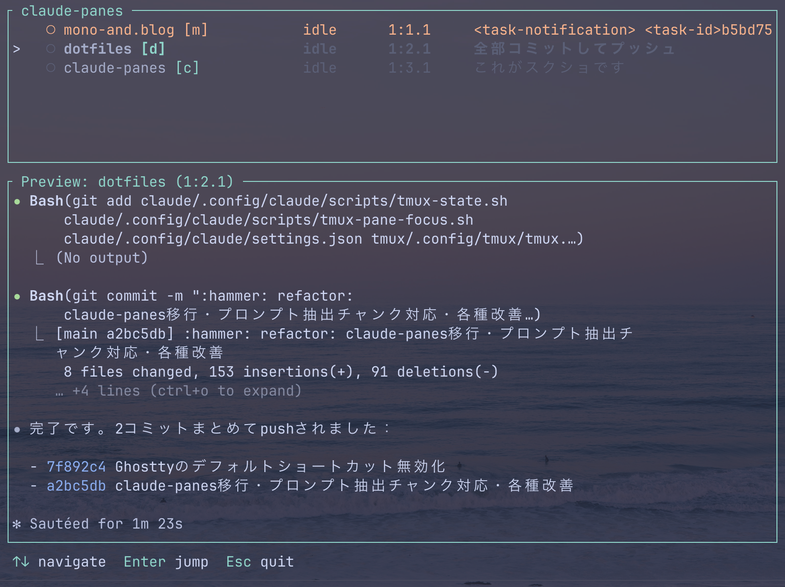

# claude-panes

**Monitor all your Claude Code tmux sessions from a single dashboard.**




## Why claude-panes?

Running multiple Claude Code sessions in tmux makes it hard to know which instance is active, what it's working on, or whether it's stuck. claude-panes gives you a live dashboard to monitor and switch between all instances at a glance.

## Features

- **Multi-instance monitoring** -- List all active Claude Code instances across tmux sessions
- **Live preview** -- Pane output with ANSI color support
- **Last prompt display** -- See what each instance was asked
- **Smart filtering** -- Type to filter by project name; shortest unique keywords (e.g. `m1`, `m2`) are auto-generated for quick selection
- **Auto-jump** -- When filtering narrows to a single match, jumps automatically
- **Quick navigation** -- Jump directly to any pane with Enter
- **Auto-refresh** -- Updates every second with stable ordering
- **Pane auto-select** -- Highlights the current pane on startup
- **Stale detection** -- Detects when Claude has exited or stopped responding; pane title spinner detection prevents false "idle" during long thinking
- **Configurable** -- Layout, border color, and status stripping via config file

## How It Works

```
Claude Code hooks ──> ~/.claude/pane-state/pane-*   (status + project name)
                  ──> ~/.claude/pane-state/prompt-*  (last user prompt)
                              |
claude-panes TUI <------------+--------> tmux list-panes  (cross-reference + pane title)
                              |
                         tmux capture-pane  (live preview)
```

1. Claude Code hooks write state files on session events (start, prompt, tool use, stop, end)
2. claude-panes reads these files, cross-references with `tmux list-panes`, and displays a live dashboard
3. Stale "working" status is corrected to "idle" when the foreground process is a shell (Claude exited) or the heartbeat has stopped (unless a pane title spinner indicates Claude is still thinking)

## Prerequisites

- [tmux](https://github.com/tmux/tmux)
- [Claude Code](https://docs.anthropic.com/en/docs/claude-code) with hooks configured (see below)
- [Rust toolchain](https://rustup.rs/) (for building)

## Installation

```bash
git clone https://github.com/gunubin/claude-panes.git
cd claude-panes
cargo install --path .
```

## Hook Setup

claude-panes requires Claude Code hooks to write state files.

### Automatic (recommended)

```bash
claude-panes setup
```

This will:
1. Create `~/.claude/scripts/tmux-state.sh` with the hook script
2. Add 5 hooks to `~/.claude/settings.json` (existing hooks are preserved)

Verify the setup:

```bash
claude-panes setup --check
```

To remove hooks and script:

```bash
claude-panes setup --uninstall
```

### Manual

<details>
<summary>Click to expand manual setup instructions</summary>

#### 1. Create the hook script

Save the following as `~/.claude/scripts/tmux-state.sh` and make it executable (`chmod +x`):

```bash
#!/bin/bash
# tmux-state.sh - Claude Code hook: write pane state for claude-panes

ICON_WORKING="▶"
ICON_WAITING="●"
ICON_IDLE="○"
ICON_ERROR="✕"

[ -z "$TMUX" ] && exit 0

input=$(cat)
event=$(echo "$input" | jq -r '.hook_event_name // "unknown"' 2>/dev/null)

PANE_ID="$TMUX_PANE"
[ -z "$PANE_ID" ] && exit 0
STATE_DIR="$HOME/.claude/pane-state"
PANE_FILE="$STATE_DIR/pane-${PANE_ID}"

# Project name from this pane's directory (-t ensures correct pane, not active pane)
DIR_NAME=$(basename "$(tmux display-message -p -t "$PANE_ID" '#{pane_current_path}')")

case "$event" in
    SessionStart)
        mkdir -p "$STATE_DIR"
        chmod 700 "$STATE_DIR" 2>/dev/null
        echo "${ICON_IDLE} ${DIR_NAME}" > "$PANE_FILE"
        ;;
    UserPromptSubmit)
        echo "${ICON_WORKING} ${DIR_NAME}" > "$PANE_FILE"
        prompt=$(echo "$input" | jq -r '.prompt // ""' 2>/dev/null)
        echo "$prompt" > "$STATE_DIR/prompt-${PANE_ID}"
        ;;
    PreToolUse)
        # Heartbeat: refresh mtime to prove Claude is still working
        [ -f "$PANE_FILE" ] && touch "$PANE_FILE"
        ;;
    Stop)
        echo "${ICON_WAITING} ${DIR_NAME}" > "$PANE_FILE"
        ;;
    SessionEnd)
        rm -f "$PANE_FILE" "$STATE_DIR/prompt-${PANE_ID}"
        ;;
esac

exit 0
```

#### 2. Register hooks in settings.json

Add the hooks section to `~/.claude/settings.json`:

```json
{
  "hooks": {
    "SessionStart": [
      { "matcher": "", "hooks": [{ "type": "command", "command": "~/.claude/scripts/tmux-state.sh" }] }
    ],
    "UserPromptSubmit": [
      { "matcher": "", "hooks": [{ "type": "command", "command": "~/.claude/scripts/tmux-state.sh" }] }
    ],
    "PreToolUse": [
      { "matcher": "", "hooks": [{ "type": "command", "command": "~/.claude/scripts/tmux-state.sh" }] }
    ],
    "Stop": [
      { "matcher": "", "hooks": [{ "type": "command", "command": "~/.claude/scripts/tmux-state.sh" }] }
    ],
    "SessionEnd": [
      { "matcher": "", "hooks": [{ "type": "command", "command": "~/.claude/scripts/tmux-state.sh" }] }
    ]
  }
}
```

</details>

<details>
<summary>State file format</summary>

| File | Format | Example |
|------|--------|---------|
| `~/.claude/pane-state/pane-%<id>` | `<symbol> <project>` | `▶ my-project` (working), `● my-project` (waiting), `○ my-project` (idle), `✕ my-project` (error) |
| `~/.claude/pane-state/prompt-%<id>` | Plain text | `Fix the login bug` |

</details>

## Usage

Run inside a tmux session:

```bash
claude-panes
```

Recommended: bind to a tmux key for quick access:

```tmux
bind C-a display-popup -E -w 60% -h 70% "CLAUDE_PANES_CALLER_PANE=$TMUX_PANE claude-panes"
```

> `CLAUDE_PANES_CALLER_PANE` tells claude-panes which pane launched the popup, so it can auto-select the correct instance.

### Keybindings

| Key | Action |
|-----|--------|
| `Up` / `Down` | Navigate instances |
| `Enter` | Jump to selected pane |
| `Esc` | Quit |
| `Backspace` | Delete filter character |
| Any character (except space) | Filter by project name |

## Configuration

Create a config file at the platform config directory:

- **macOS**: `~/Library/Application Support/claude-panes/config.toml`
- **Linux**: `~/.config/claude-panes/config.toml`

```toml
border_color = "cyan"   # red, green, blue, cyan, gray, white, yellow, magenta, or #RRGGBB
strip_status = true     # Remove Claude Code's status bar from preview

[layout]
list_percentage = 30    # Height of instance list (%)
preview_percentage = 70 # Height of preview pane (%)
```

All fields are optional. Values shown above are the defaults.

## Troubleshooting

| Symptom | Cause | Fix |
|---------|-------|-----|
| No instances shown | Hook not writing state files | Run `claude-panes setup --check` to verify setup |
| Icons show as boxes | Terminal doesn't support Unicode | Use a terminal with Unicode support (most modern terminals) |
| Status always shows idle | PreToolUse heartbeat not configured | Run `claude-panes setup` to install all hooks |
| Status flips to idle during long thinking | Claude thinks >30s without tool use and pane title has no spinner | Spinner detection mitigates this; some terminals may not expose pane title |
| "not inside a tmux session" | Running outside tmux | Run `claude-panes` inside a tmux session |
| Last prompt column is empty | No `UserPromptSubmit` hook or session not yet prompted | Add `UserPromptSubmit` hook; prompt will appear after next submission |

## Contributing

Contributions welcome! Fork, branch, and open a PR.

```bash
cargo test && cargo clippy && cargo fmt --check
```

## License

MIT
